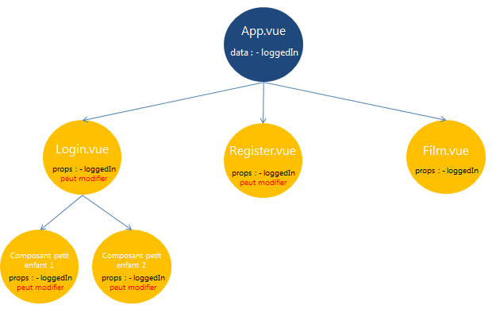
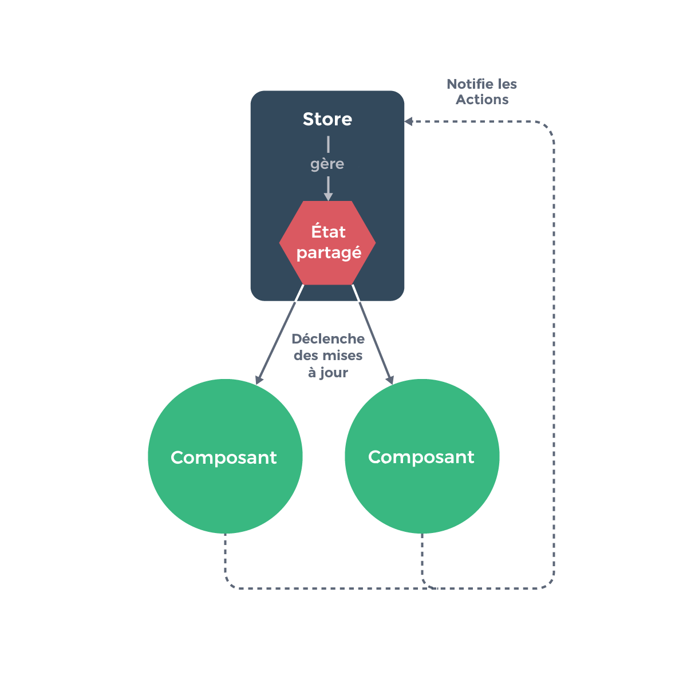

### Migration Vue 2 => Vue 3

``vue add vue next`` 
Upgrade la version de Vue.

Problèmes de compatibilité:
- vue-mapbox (remplacé par mapbox)

### Ajouter typescript

``vue add typescript``
Transforme les fichiers .js en .ts et modifie le code
Cependant, il reste beaucoup de modifications à faire à la main.

Problèmes de compatibilité:
- timeago.js (remplacé par vue-moment)

##### Modifications à faire:
- Préciser ``lang="ts"`` dans les balises script des components
- Les routes et les imports se déclarent différemment
- Les exports ``export default {}`` doivent être remplacés par ``export default defineComponent({})``, sans oublier de rajouter l'import ``import { defineComponent } from 'vue';``
- Dans le fichier ``main.ts``, pour utiliser le routeur il faut déclarer: ``createApp(App).use(router).mount('#app');``

/!\ A l'installation de typescript, le component ``HelloWorld`` est ajouté et le contenu de ``App.vue`` est écrasé.


## Exercice 2.2

#### La gestion de l'état

Il est mis en place dans un but : s'assurer que l'application utilise les bonnes données à tout moment.
L'état (state) peut être défini comme un instantané du data store à un moment donné. 
De multiples states sont utilisés à travers une application, ce qui explique la complexité inhérente à la gestion de ces éléments. Après tout, chaque composant utilisé contient sa propre propriété ``data``, ce qui signifie qu'il gère son propre state. Une fois que l'on ajoute la complexité du passage de données entre composants, cela devient effectivement très compliqué.


#### Gestionnaire d'état

À mesure que les applications grandissent et se complexifient, des composants très éloignés dans l'arborescence peuvent être amenées à manipuler les mêmes données. 
Il devient alors très fastidieux de les faire communiquer entre eux pour travailler sur les mêmes références de données. 
C'est pourquoi il existe des solutions plus ou moins complexes de gestion d'état, ou state management.

C'est une application autosuffisante avec les parties suivantes :

- L'état, qui est la ``source de vérité`` qui pilote votre application,
- La vue, qui est une réflexion déclarative de l'état,
- Les actions, qui sont les façons possibles pour l'état de changer en réaction aux actions utilisateurs depuis la vue.

Représentation extrêmement simple du concept de « flux de donnée unidirectionnel » :


##### Pourquoi une solution de gestion d'état ?




- parce que propager une variable en props d'un composant parent aux composants petits-enfants et arrière-petits-enfants devient vite fastidieux
- pour pouvoir partager de l'information entre différents arbres de composants
- pour déléguer la gestion de données à un service accessible depuis tous les composants
- pour pouvoir persister automatiquement les données (en localStorage par ex.)
- pour historiser les états de l'application, faire des rollbacks ou une fonctionnalité Annuler
- pour aider au débogage, aux logs, au monitoring ou encore à la transmission de rapports d'erreur


#### Vuex
https://openclassrooms.com/fr/courses/6390311-creez-une-application-web-avec-vue-js/6869761-creez-un-data-store-centralise-avec-vuex

Vuex est un gestionnaire d'état (« state management pattern ») et une bibliothèque pour des applications Vue.js. Il sert de zone de stockage de données centralisée pour tous les composants dans une application, avec des règles pour s'assurer que l'état ne puisse subir de mutations que d'une manière prévisible. Il s'intègre également avec l'extension officielle (opens new window)de Vue afin de fournir des fonctionnalités avancées comme de la visualisation d'état dans le temps et des exports et imports d’instantanés (« snapshot ») d'état.

Pour l'installer: ``vue add vuex``

Toutes les actions qui changent l’état du store sont mises à l’intérieur du store lui-même. Ce type de gestion d’état centralisé permet de comprendre plus facilement quel type de mutations peuvent survenir et comment elles sont déclenchées. Maintenant, quand quelque chose tourne mal, nous aurons également un log sur ce qui a conduit à ce bug.
De plus, chaque instance/composant peut gérer lui-même son propre état privé :

```javascript
var vmA = new Vue({
  data: {
    privateState: {},
    sharedState: store.state
  }
})

var vmB = new Vue({
  data: {
    privateState: {},
    sharedState: store.state
  }
})
```




Dans Vuex, notre data store est défini en tant que ``state`` dans l'objet de configuration ``store/index.js``


Pour accéder aux données dans la vue, on utilise ``{{$store.state.nomdeladonee}}``


Vuex fonctionne selon les principes suivants :

- Une mutation est une fonction qui modifie l'état du store. Elle est obligatoirement synchrone.
- Une action est une fonction qui déclenche une ou plusieurs mutations. Elle peut être asynchrone.
- Les composants modifient l'état applicatif en invoquant des actions
- L'état muté à la suite de mutations met à jour de façon réactive toutes les vues associées, peu importe leur niveau dans l'arborescence


```
« Les librairies Flux, c'est comme les lunettes : vous saurez quand vous en aurez besoin. »
```
<div style="text-align: right"> Dan Abramov, auteur de Redux </div>


### Quelles sont les limites du système de gestion d’état par les props ?
Dans une application Vue, il est courant que différents composants doivent utiliser la même variable.
Pour que cela fonctionne, il faut souvent passer la même variable entre beaucoup de composants. Des variables sont transmises d’un composant à l’autre tout au long de l’arborescence, ce qui fait du code un désordre illisible.
Au bout d'un moment, la gestion de l'état devient très complexe.


### Quel est le nom du pattern implémenté par vuex ?
State management pattern - Pattern de store centralisé


Vuex est basée sur l'architecture Elm => https://guide.elm-lang.org/architecture/


### Quel est le nom de la librairie équivalente dans le monde react ?
Redux

### Quelles sont les différences entre les mutations et les actions ?

Une action est une fonction qui déclenche une ou plusieurs mutations. Une mutation permet de modifier l'état dans un store.
Chaque mutation a un type sous forme de chaine de caractères et un gestionnaire.

Les mutations sont synchrones. Les mutations peuvent être synchrones ou asynchrones.

Mutation => changer l'état du state. On lui passe une action